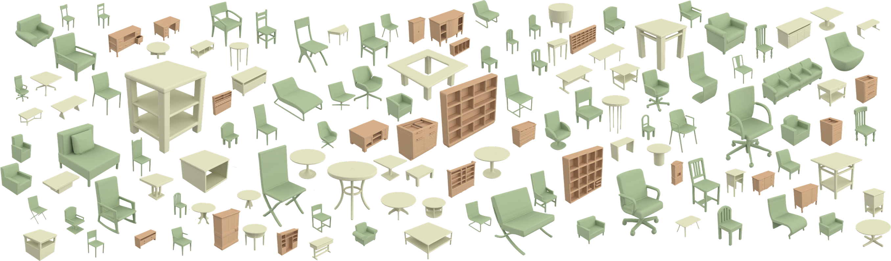

# Neural Wavelet-domain Diffusion for 3D Shape Generation [SIGGRAPH Asia 2022] 



# Environments
You can create and activate a conda environment for this project using the following commands:
```angular2html
conda env create -f environment.yml
conda activate WaveletGeneration
pip install git+https://github.com/fbcotter/pytorch_wavelets
```

# Dataset
For the dataset, we use the data split provided by [IM-NET](https://github.com/czq142857/IM-NET-pytorch) for training and evaluation.
For ease of data preparation, we provided pre-computed coarse and detail coefficient volumes in this [link](https://drive.google.com/file/d/1p1xJqVejw_qaoZTdx7dv8VtUTsT3Dg5A/view?usp=share_link), and you can unzip it into ```wavelet_data``` folder.


For the data processing, it involves running 4 files in order: ```flip_axis.py```, ```to_manifold.py```, ```sample_sdf.py``` and ```convert_wavelet.py```. 
These four files will flip the orientation of the mesh, convert them into watertight meshes, sampling the sdf values and finally convert it to wavelet coefficients.

To prepare the dataset, you must first download the ShapeNetV1 dataset from [https://shapenet.org/](https://shapenet.org/).

Before running `flip_axis.py`, set the ShapeNet root folder in the `root` variable.

To run `to_manifold.py`, you must first compile the library in `external/Manifold` according to the instructions given in [https://github.com/hjwdzh/Manifold](https://github.com/hjwdzh/Manifold).
After that, also set the ShapeNet root folder in the `root` variable.

To run `sample_sdf.py`, you need to install a modified version of `mesh_to_sdf` by running:

```
cd external/mesh_to_sdf
pip install .
```

Before running `sample_sdf.py`, set the ShapeNet root folder in the `data_folder` variable, and set the folder to save SDF samples in the `save_folder` variable.
To choose which objects to sample SDF values, specify a txt filename in the `obj_names_path` variable. You can follow the name format from [IM-NET](https://github.com/czq142857/IM-NET-pytorch), or use the names provided in our data processing [here](https://drive.google.com/file/d/1vvoxJXsQgXHWt7rutsoKWrZFgr_Zdftd/view?usp=share_link).

Finally, you can run `convert_wavelet.py` after setting the folder to save SDF samples in the `sdf_save_folder` variable, the folder to save the wavelet coefficients in the `npy_save_folder` variable, and the ShapeNet category ID in the `category_id` variable.
Note that setting `resolution_index` to 3 generates the coarse wavelet coefficients, while setting it to 2 generates the detail wavelet coefficients.


# Training
Our training and inference mainly depend on the config file (```config.py``` or ```config_highs.py```).

Before running the training, you should specify the location of the data in the config files.
In particular, you can need to set ```data_files```the path of two npy files downloaded or created, and an example is shown as follow:
```angular2html
data_files = [('wavelet_data/03001627_0.1_bior6.8_3_zero.npy', 3), ('wavelet_data/03001627_0.1_bior6.8_2_zero.npy', 2)]
```

For the training of diffusion model, you can run the following command:
```angular2html
python trainer/trainer.py --resume_path ./configs/config.py
```

For the training of detail predictor, you can run the following command:
```angular2html
python trainer/trainer.py --resume_path ./configs/config_highs.py
```

# Inference
We provided our pre-trained models for our method. You can unzip the file ([link](https://drive.google.com/file/d/1R9cRykZajvYwXSRIddQIVKaq8D06BM-K/view?usp=share_link)) in the ```pretrain``` folder. Note that the pre-trained models are trained with a setting slightly different from the original one (mainly on the batch size, learning rate, and training iteration), but the performance should be compatible.

To run the inference for different categories, you need to edit ```models/network_gen.py``` and set ```<category>``` of ```diffusion_folder``` and ```high_level_folder``` to one of the four categories (```chair```, ```table```, ```airplane``` and ```cabinet```).
Also, you need to set the epoch numbers of pretrained models in ```epoch``` and ```high_level_epoch```.

After setting the above, you run the inference by running:
```angular2html
python models/network_gen.py
```

Note that if you inference your own trained model, you need to set the above variables according to your training output folders and epoch numbers.

[27/3/2023 Update] We also provide the original pre-trained models of the chair and airplane categories in ([link](https://drive.google.com/file/d/1aDcgK8SPSb6JY7mpngh5V29EyWS0M43W/view?usp=share_link)). Besides, we provide the generated meshes of the ([chair](https://drive.google.com/file/d/1VD64JcXYYFc600CZSnIs2w4ggE1OP44g/view?usp=share_link)) and ([airplane](https://drive.google.com/file/d/1BSecRMy0k60qkgwsM67Qo4YBxzdZ2grh/view?usp=share_link)).

### Note: 
you need to set ```PYTHONPATH=<project root directory>``` before running any above commands.

### Citation
If you find our work useful in your research, please consider citing:
```
@article{hui2022wavelet,
    title = {Neural Wavelet-domain Diffusion for 3D Shape Generation},
    author = {Ka-Hei Hui and Ruihui Li and Jingyu Hu and Chi-Wing Fu},
    joural = {SIGGRAPH Asia 2022 Conference Papers},
    month = {December},
    year = {2022},
}
```

